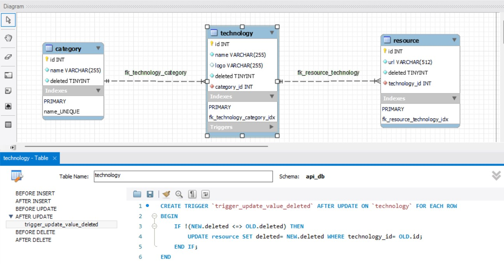

# 02-lab-php-api_project

## CONSIGNE

Vous devez créer une API REST en php qui permettra de créer, lire, mettre à jour et supprimer une technologie dans le développement web.

Base de données :

Organiser une base de données MCD avec workbench pour l’API stocker le nom de la technologie exemple : Ruby. 
De définir les différentes catégories de la technologie exemple : Langage de programmation et développement frontal. 
De définir un ou plusieurs liens de ressources. 
Stocker le logo de la technologie.
L’API pourra aussi créer, lister, modifier et ajouter des catégories.
    
    Voici les catégories que l’on peut utiliser :
    - Langages de programmation, 
    - Frameworks et bibliothèques, 
    - Base de données, 
    - Développement front end, 
    - Développement back end, 
    - Sécurité web, 
    - Déploiement et gestion de serveurs, 
    - Développement mobile et responsive, 
    - Outils de développement,
    - Tendances et nouveautés,
    - Communauté et ressources d'apprentissage.

Mettre en oeuvre la base de données à partir d’un fichier sql que vous importerez.

Tester son API :
Vous testerez vos différentes url avec postman ou autre outils de test d’API comme des plugings disponible sur VS Code

Attention :
Sur votre git dans le readme.md je dois retrouver toutes la documentation et les url de votre API REST.

Serveur de base de données : 
Sur un container Docker Serveur apache + php AVEC écriture d’url sur un autre container ou container séparé si le défi vous tente . Toutes les url devrons arriver sur index.php
On pourra atteindre ce projet avec le nom de domaine : php-dev-2.online

Production attendue :
- Page PHP
- Les médias
- Le diagramme du modèle de données
- L’export de la base de données db.sql

## STEPS

- Search for information on API REST
- Database diagram
- Docker container setup and configuration
- Create a class for connection db
- Create classes on one table (category) : entity/model, manager, controller with only "get" SQL queries for testing purposes
- Create router
- Create the other queries for the first class
- Create the other classes and relatives queries

### Database diagram

## Link Code
Find code in this <a href ="https://github.com/JoeWebDev70/02-lab-php-api">repository</a>
